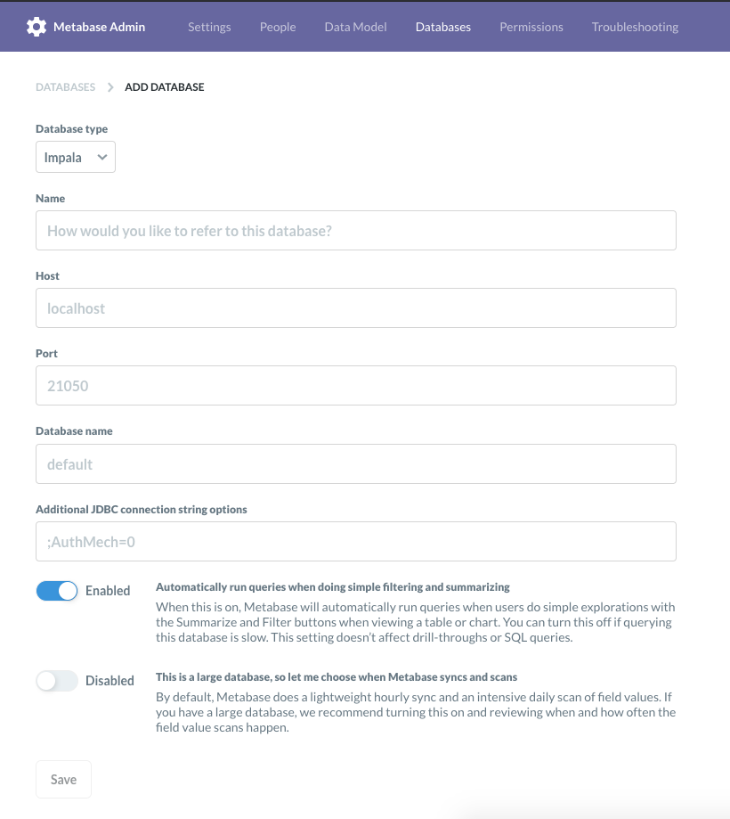

# metabase-impala-driver

## Usage

1. Copy [`impala.metabase-driver.jar`](https://github.com/XUJiahua/metabase-impala-driver/releases) to metabase `plugins` folder.
2. Restart metabase.
3. Add a Impala server.



`Additional JDBC connection string options` is used for Authentication to Impala Server.

### Impala JDBC connection string

Using No Authentication

```
jdbc:impala://localhost:21050;AuthMech=0;
```

Using Kerberos

```
jdbc:impala://node1.example.com:21050;AuthMech=1;KrbRealm=EXAMPLE.COM;KrbHostFQDN=node1.example.com;KrbServiceName=impala
```

For more infomation, reference the Impala JDBC Guide.

## Initial tests passed

(works fine for me)

Metabase Release | Driver Version | Impala Version
---------------- | -------------- | --------------
0.35.4           | 1.0.0-SNAPSHOT-2.6.17 | 2.5.0
0.35.4           | 1.0.0-SNAPSHOT-2.6.17 | 3.2.0

## Building from Source

Download impala JDBC driver from [Cloudera](https://www.cloudera.com/downloads/connectors/impala/jdbc/2-6-17.html)
to local `lib` folder.

```
tree lib

lib
└── ImpalaJDBC42.jar
```

Build:

```
make install-local-jar
make build
```

get driver from `target/uberjar/impala.metabase-driver.jar`

### Dev

Reference [dev.md](doc/dev.md).

## FAQ

### Kerberos

> Caused by: com.cloudera.impala.support.exceptions.GeneralException: [Cloudera][ImpalaJDBCDriver](500151) Error setting/closing session: Socket is closed by peer..

Maybe your Impala server is protected by Kerberos Authentication. Try below.

#### option 1

`kinit` first and run below:


```bash
java -Djavax.security.auth.useSubjectCredsOnly=false -jar metabase.jar
```

#### option 2

`jaas.conf`

```
Client {
    com.sun.security.auth.module.Krb5LoginModule required
        useKeyTab=true
        keyTab="/path/to/my_keytab"
        principal="username@MYREALM"
        doNotPrompt=true;
};
```

```bash
java -Djava.security.auth.login.config=jaas.conf -jar metabase.jar
```

Reference：

1. https://github.com/metabase/metabase/pull/3749/files#diff-c6ba292a2a11211cb51990e2a5e11eb8
