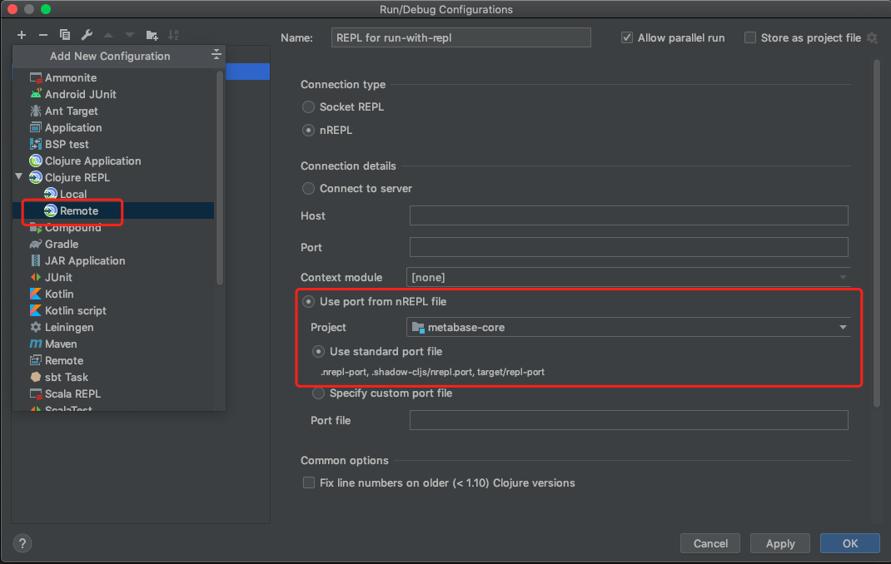
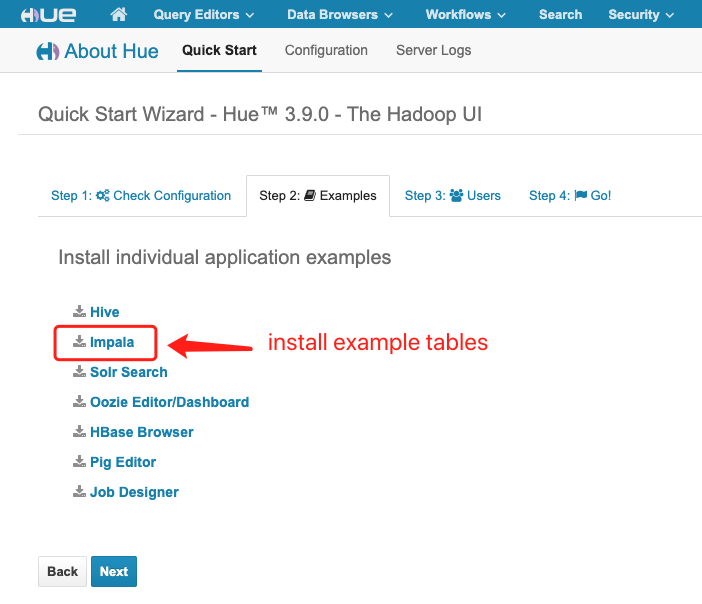
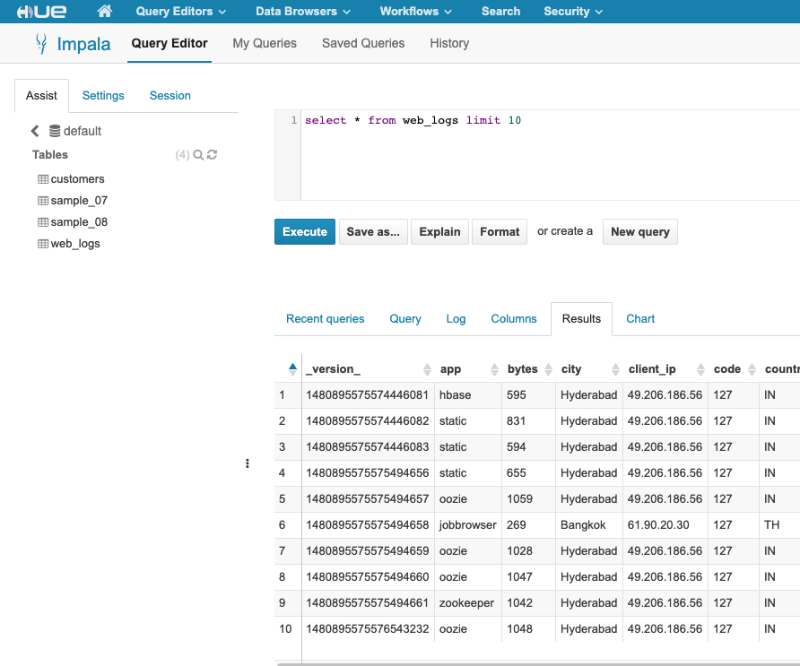

### Dev setup

Clone code in metabase drivers folder.

```
cd /path/to/metabase/modules/drivers

git clone https://github.com/XUJiahua/metabase-impala-driver.git impala
```

Download impala JDBC driver from [Cloudera](https://www.cloudera.com/downloads/connectors/impala/jdbc/2-6-17.html)
to local impala `lib` folder.

```
tree lib

lib
└── ImpalaJDBC42.jar
```

Install lib jar into local maven repo.

```
make install-local-jar
```

#### Option 1

Build.

```
make build
```

Make a softlink to metabase plugins folder.

```
make link-plugins
```

In metabase folder, start server.

```
lein run
```

#### Option 2 (recommend)

In metabase folder, start repl server.

```
lein run-with-repl
```

Use Cursive (below configuration), debug driver code in REPL.



### start impala server

impala server version 2.5.0

```
make start-impala-server
```

1. Open Hue: http://localhost:8888
2. username/password: cloudera/cloudera





If you can run sql query, the setup should be done.
